# Interaction Design - COM525AE1

## Introduction

This portfolio explores 5 modern/minimalist design components, created using Adobe XD and a React application environment. Each component is presented with research, evaluation, planning, code and results.

These components can be interacted with by accessing the following URL:
Hosted Site: https://diogorhjmatos.github.io/COM525AE1/

---

## Table of Contents

[1. Login](#1-Login)

- Research
- Evaluation of guidelines
- Planning and design prototype
- Code
- Screencast
- Reflection

[2. Buttons](#2-Buttons)

- Research
- Evaluation of guidelines
- Planning and design prototype
- Code
- Screencast
- Reflection

[3. Navigation](#3-Navigation)

- Research
- Evaluation of guidelines
- Planning and design prototype
- Code
- Screencast
- Reflection

[4. Card](#4-Card)

- Research
- Evaluation of guidelines
- Planning and design prototype
- Code
- Screencast
- Reflection

[5. Modal](#5-Modal)

- Research
- Evaluation of guidelines
- Planning and design prototype
- Code
- Screencast
- Reflection

[References](#References)

---

## 1. Login

### Research

The login page is an important design component of any modern website, it is a powerful tool that can help shape the user experience.

Since nowadays, almost everything on the web requires the user to have an account to access a service, it is mandatory to inspire a sense of security (Amelia, data). If this component is poorly designed, it will be perceived by the user as something sketchy and untrustful.

According to Rebeka Costa(data), a login design should be both easy to understand and require no thoughts from the user.

### Evaluation of guidelines

To develop this component, a minimum of two input fields are necessary; a username or email field, and a password field. To help the user signing in and prevent user errors, the form should alert the user for any mistakes, or missing data.

The login form should also let the users check their password if needed. This allows the user to feel more in control of its password, and therefore, its security.

### Planning and design prototype

To develop the component’s prototype, the first thing to consider was how the information should be grouped and presented to the user.

First, a simple white container was designed with round corners to better assist in being user-friendly. A header displaying the function of the form was created and separated from the rest of the form to give it more prominence. Labels and inputs were grouped so that their understanding is more noticeable.

Lastly, the “sign in” button was designed. Being the only object that has chromatic colour, it will grab the users attention to fill the required fields.

A dark “eye” icon was also added to the password input to reinforce the idea that the password visibility can be toggled at need.

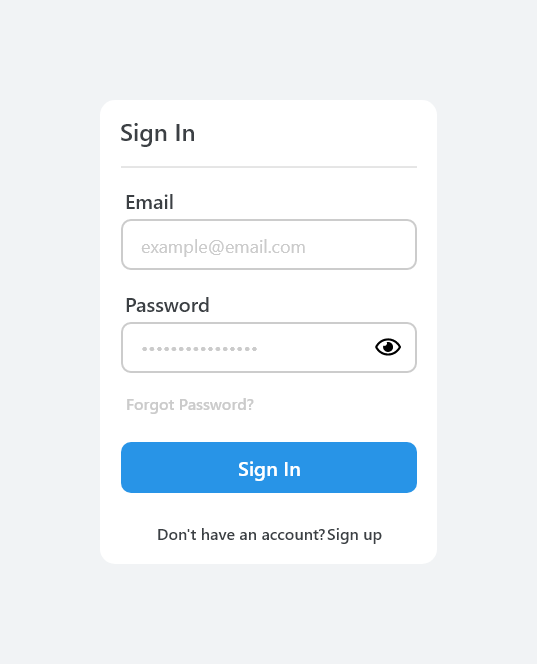

### Code

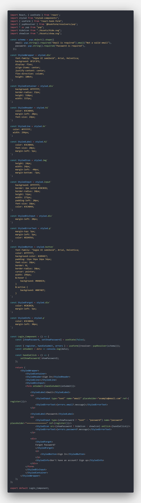

### Screencast

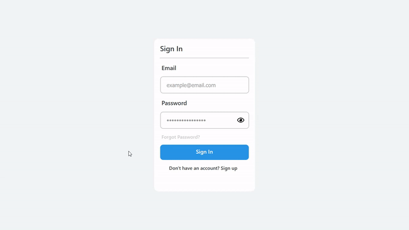

### Reflection

This component was developed following the research principles of being easy to understand and require almost no thoughts from the user, creating a minimalist, user-friendly design that works and engages with the user.

Although minimal, security measures such as user error and password visibility were effectively added to the design, making the user feel more comfortable while filling the form.

---

## 2. Buttons

### Research

Even though they can get unnoticed, buttons are for sure one of the most important components of any website. Buttons have the power to appeal to the user to navigate and interact with the product (Rebeka, data).

Because of its importance, it’s not only crucial to understand how to create a good-looking, appealing button, but also its placement within the product. As stated by Will Fanguy (2018), if properly implemented, it will not only create a positive user experience but also make sure the website calls to action (CTA) are completed.

Buttons can have different states. From the default state, hover state, active state or even the disabled state, it's always important to consider its design to give the user a good experience.

### Evaluation of guidelines

To design this component, one of the most important things to consider is its size. This is directly related to the padding of the text inside. Too little vertical/horizontal padding can seem claustrophobic, too much padding and will start to lose its importance. It needs to be balanced, as all things should be.

The second most important aspect to consider is the button states. Different states should have different characteristics to give the user the proper feedback. This can be achieved with the help of shadows, colour variations or even shape.

### Planning and design prototype

For this component’s prototype, lowercase text with 18px font size was used to deliver a more friendly experience that is otherwise, hard to achieve with uppercase.

After choosing how to deliver the text inside the button, vertical padding of 14px and horizontal padding of 56px were added. This ensured a great balance of the size of the button.

Next, using the frame of the previously created button, a secondary type button was designed. Because of its nature, the secondary button should be the second to catch the users attention for an action. With this in mind, a border was added, leaving its interior empty of focus.

To differentiate the button states, colour variants were used to indicate that the state has changed.

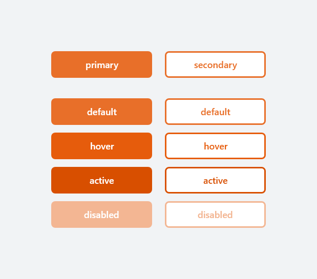

### Code

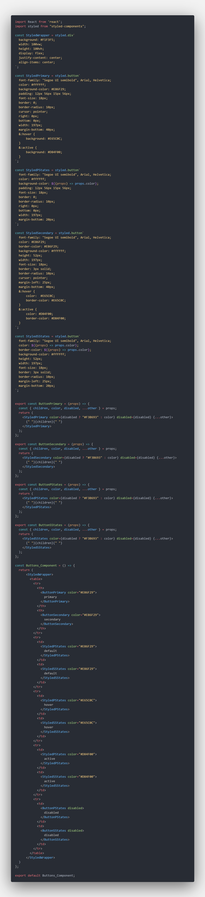

### Screencast

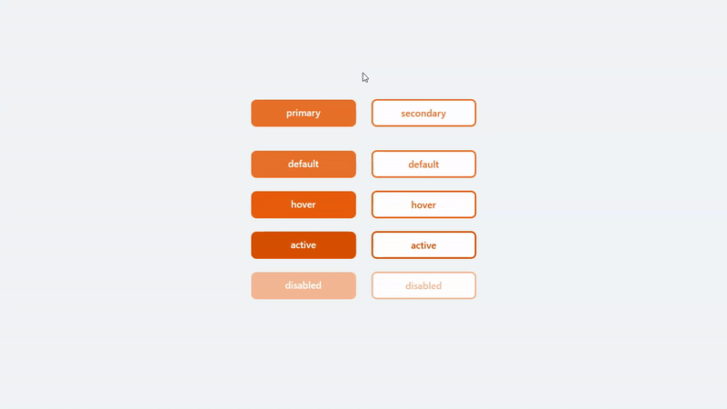

### Reflection

Following the research and guidelines presented above, this component was designed to invite the user to complete a website CTA. By giving it a good size balance between text and the overall button, this component is not only simple but also effective on its mission.

---

## 3. Navigation

### Research

Navigation may be one of the most important components of any website, if not the most important. Having an exciting and well-designed website is useless if the users are unable to explore and navigate around it (Balanco, data).

There are several different ways to design navigation. The most common ones are a header on the top, which can be both fixed or stationary, a dropdown menu, or even the famous hamburger side menu (Anon, 2020).

As pointed by Costa (data), having a good navigation design can enhance a user’s understanding, give them the confidence to explore the website while also provide credibility to a product.

### Evaluation of guidelines

As pointed in this components research, good navigation needs to be both simple and obvious to the user. To achieve this, the hamburger side menu should be used because of its simplicity.

All elements inside should be well spaced from one another and have several interaction states to better guide the user.

### Planning and design prototype

Following the research and guidelines above explored, the prototype for this component was as straightforward as it could be. A container with round corners and a very predominant colour were created, this helps the user to focus its attention on the navigation menu once prompted to open.

Next, labels were added with enough space from one another so the user can “breath” between the different options. To differentiate between the different interaction states, colour variants were used as previously explored.

Finally, a close icon was added to the top part of the component, big enough for the user to click, but not too big to overcrowd the primary function of the design.

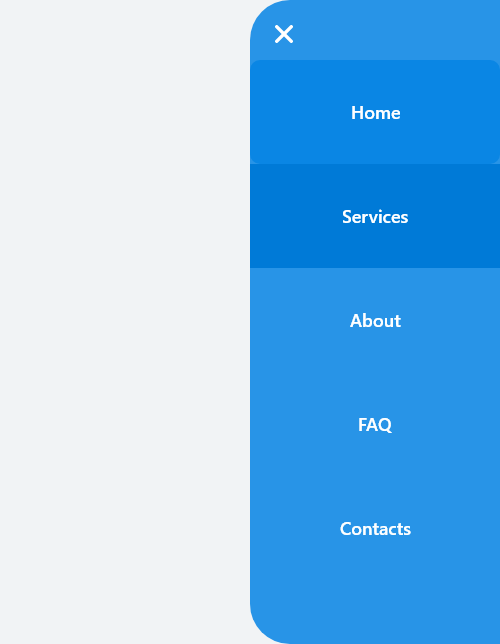

### Code

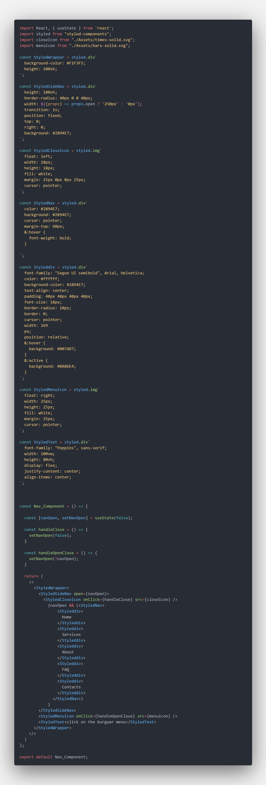

### Screencast

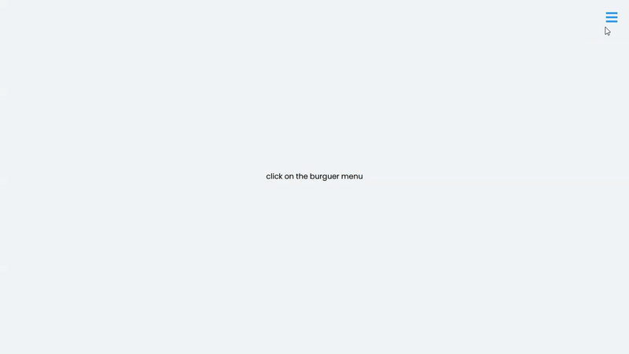

### Reflection

Even though the simplicity of this component’s design, it is easy and obvious for the user to navigate the website. Adding a smooth opening/closing transition to the side menu, creates a friendly environment that enhances the user’s confidence to explore the product with confidence.

---

## 4. Card

### Research

The fourth component is cards. By definition, a card is a container with an image and where a piece of short information is displayed (Laubheimer, 2016). Its mission is to guide the user to click and view more details related to that same card.

Although quite recent, cards are being more and more used as the main way to display information, the most important reason? Its flexibility and simplicity (Samy, 2020).

### Evaluation of guidelines

To design a good card system, the information should be concise, with emphasis on the image to create a modern/minimalist design. This creates a simple, yet eye-catching component that strengthens both the user experience and its usability.

### Planning and design prototype

Designing this components prototype was as simple as complicated to idealise.

First, a white container with round corners was created. Next, an image was placed inside with an all-around margin of 10px, this helps to produce the idea that the previously created container is wrapping around its content, without overpowering it.

Afterwards, a concise text related to the image was placed underneath it with 20px of left margin. By giving this little but perceptible margin, the text will not be too close to the right to the point it seems misplaced. The text was not chosen to be placed in the centre since that would take the focus of the image and would be too overwhelming for the design.

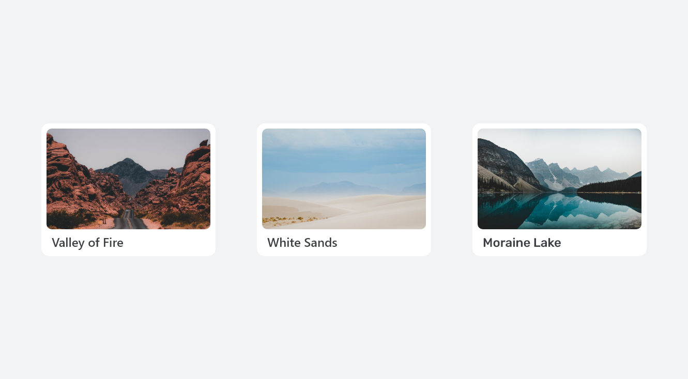

### Code

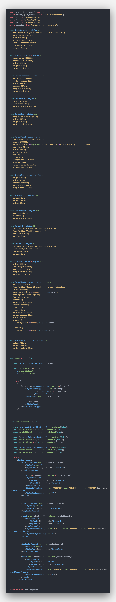

### Screencast

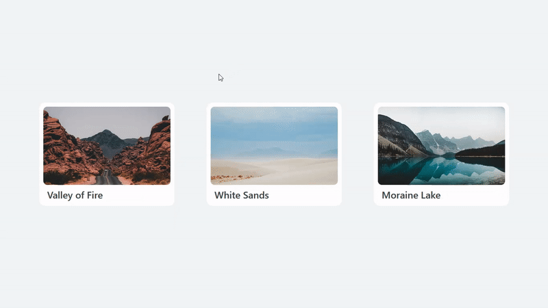

### Reflection

This design component was developed strictly following the research and guidelines above documented. This simple, eye-catching design, with short and direct information, invites the user to click and explore each card. To better show its functionality, a modal component was linked to each card.

---

## 5. Modal

### Research

The last component designed in this project was modals. Modals are containers that appear above the main content taking away its focus (Fessenden, 2017).

Sebastian (2018) akowledges that the modal screens were created to solve a simple yet important problem: users are easily distracted. The main function of this component is to create focus on important information while preventing the user from doing other things.

### Evaluation of guidelines

cenas

### Planning and design prototype

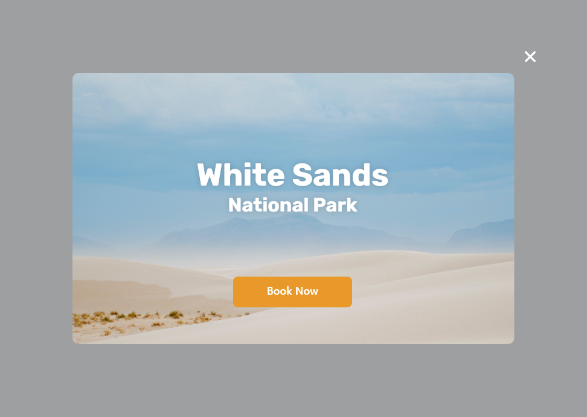

### Code

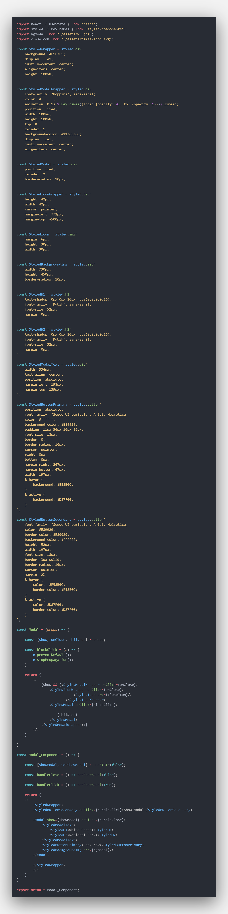

### Screencast

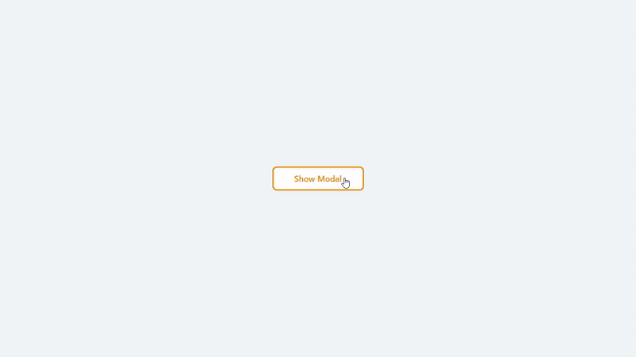

### Reflection

cenas

---

## References

cenas
