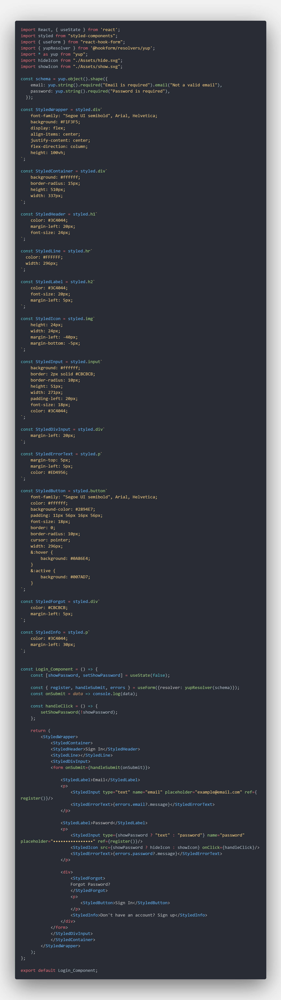
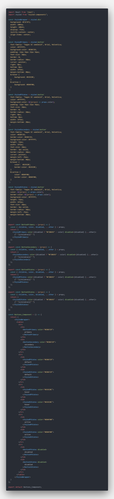
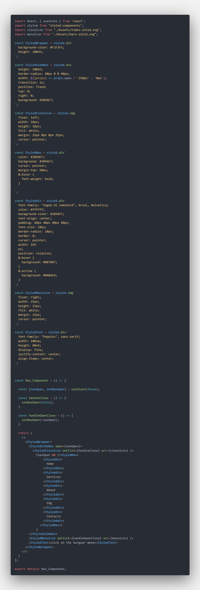
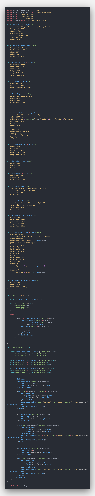
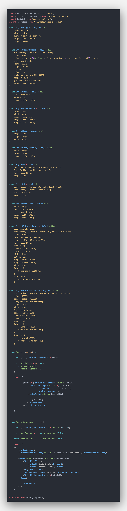

# Interaction Design - COM525AE1

## Introduction

This portfolio explores 5 design components using React. Each component is presented with research, evaluation, planning, code and results.

These components can be interacted with by accessing the following URL;
Hosted Site: https://diogorhjmatos.github.io/COM525AE1/

---

[1. Login](#1-Login)

- Research
- Evaluation of guidelines
- Planning and design prototype
- Code
- Screencast
- Reflection

[2. Buttons](#2-Buttons)

- Research
- Evaluation of guidelines
- Planning and design prototype
- Code
- Screencast
- Reflection

[3. Navigation](#3-Navigation)

- Research
- Evaluation of guidelines
- Planning and design prototype
- Code
- Screencast
- Reflection

[4. Card](#4-Card)

- Research
- Evaluation of guidelines
- Planning and design prototype
- Code
- Screencast
- Reflection

[5. Modal](#5-Modal)

- Research
- Evaluation of guidelines
- Planning and design prototype
- Code
- Screencast
- Reflection

[References](#References)

---

## 1. Login

img

### Research

A login form is for certain one of the most important design components of a website. Nowadays, almost everything on the web requires the user to have an account to access a service. But how to design a good login?
According to Rebeka Costa, a login design should be both easy to understand and require no thoughts from the user.

### Evaluation of guidelines

cenas

### Planning and design prototype

img prototype

### Code

### Screencast

gif

### Reflection

cenas

---

## 2. Buttons

img

### Research

cenas

### Evaluation of guidelines

cenas

### Planning and design prototype

img prototype

### Code

### Screencast

gif

### Reflection

cenas

---

## 3. Navigation

img

### Research

cenas

### Evaluation of guidelines

cenas

### Planning and design prototype

img prototype

### Code

### Screencast

gif

### Reflection

cenas

---

## 4. Card

img

### Research

cenas

### Evaluation of guidelines

cenas

### Planning and design prototype

img prototype

### Code

### Screencast

gif

### Reflection

cenas

---

## 5. Modal

img

### Research

cenas

### Evaluation of guidelines

cenas

### Planning and design prototype

img prototype

### Code

### Screencast

gif

### Reflection

cenas

---

## References

cenas
